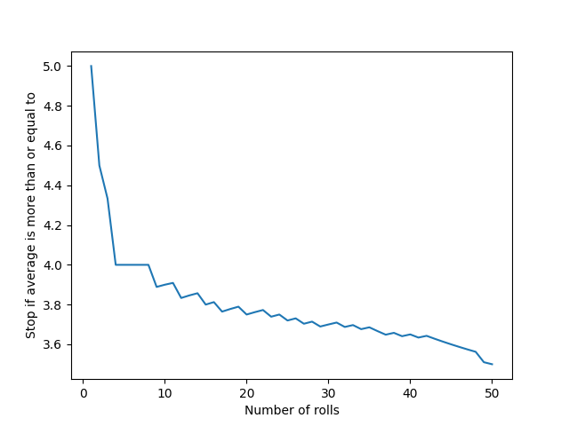

# DiceProblem

Simplified version of what is the EV if you're allowed to roll a dice as many times as you want, stop whenever and take the average dice roll as payout.

I have simplified this to you can roll the dice up to n times and if you stop
after n rolls you can take the long term average (3.5) if your average is less
than that.

This is the graph of the EVs for this problem for n from 1 to 50.

Based on this graph I guess the EV for the full problem is around 4.5.

Interestingly this approach also gives a lower bound of 4.162 for the EV if your
first roll is a 4 so you should keep going if your first roll is a 4.

Visualising what average you need to have to stop after each number of rolls
for the n=50 case gives this graph:

Slight increases are caused by gaps in discrete numbers. The "true" average if
all real number averages were possible should always decrease.
