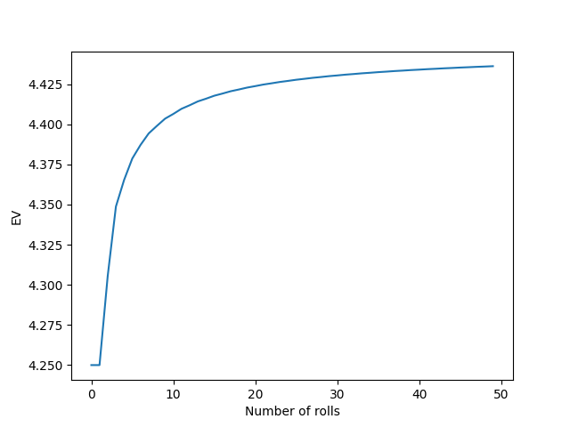

# DiceProblem

Simplified version of what is the EV if you're allowed to roll a dice as many times as you want, stop whenever and take the average dice roll as payout.

I have simplified this to you can roll the dice up to n times and if you stop
after n rolls you can take the long term average (3.5) if your average is less
than that.

This is the graph of the EVs for this problem for n from 1 to 50.

Based on this graph I guess the EV for the full problem is around 4.5.
